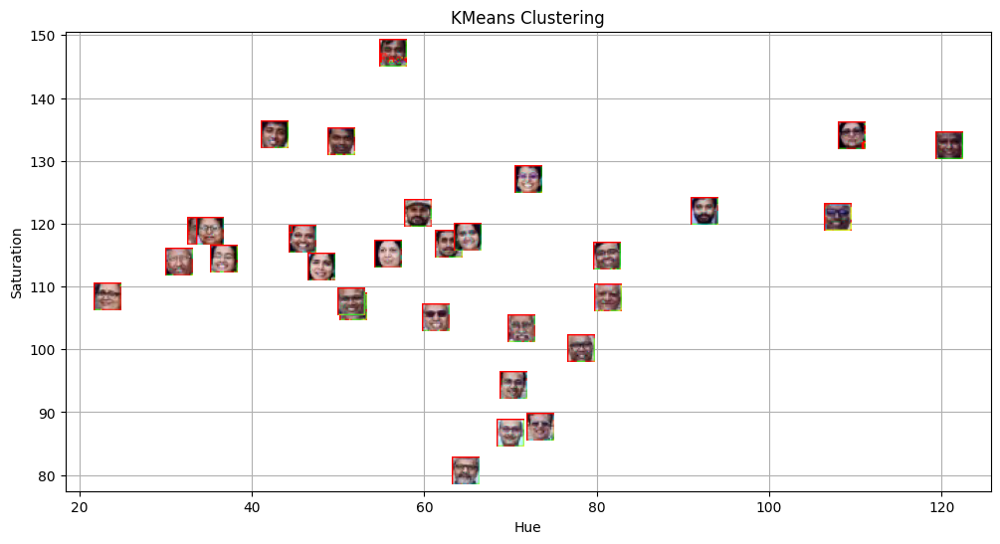
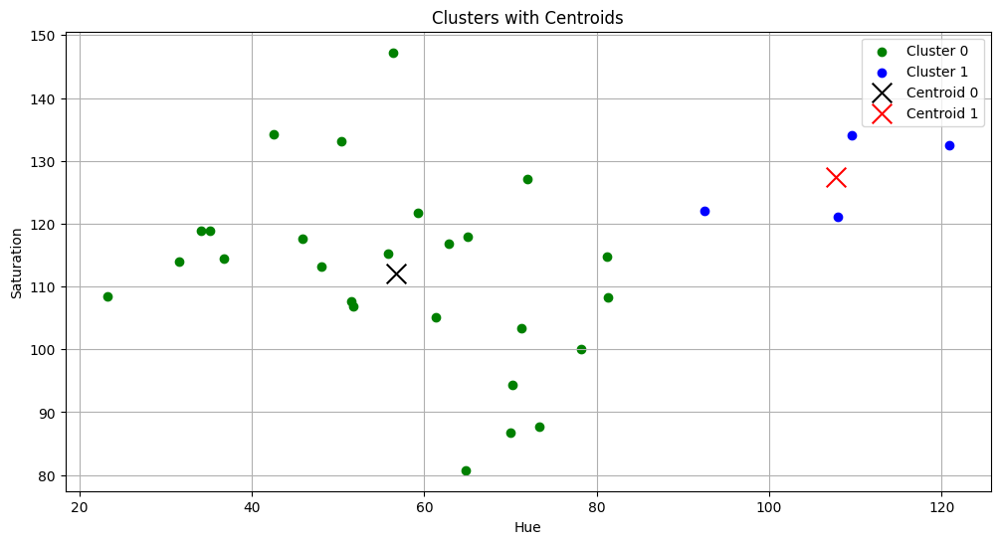
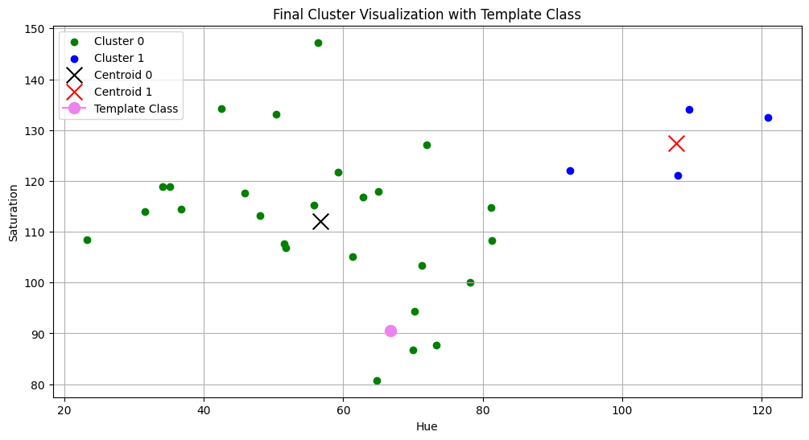
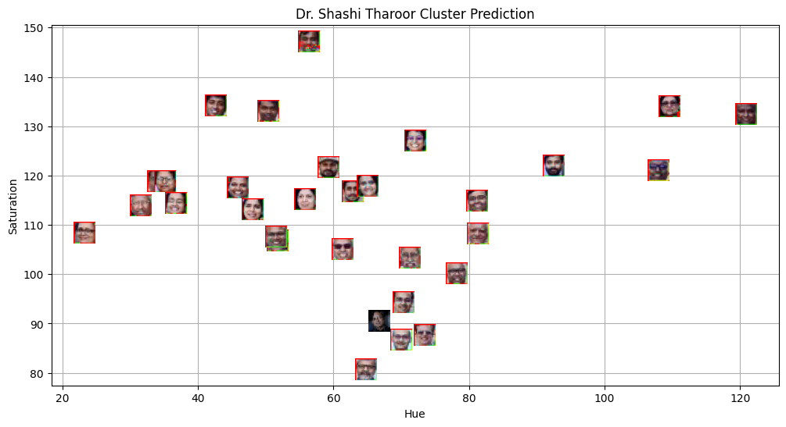

# Lab 5 – Spring 2026

---

## 📌 Overview

This project implements **face detection and clustering using color-based feature extraction**.

The objective is to:

- Detect faces in a faculty group image
- Extract color features (Hue and Saturation)
- Cluster faces using K-Means
- Classify a new template image (Dr. Shashi Tharoor) into one of the clusters
- Visualize clustering results

The implementation is done in **Python using OpenCV and Scikit-learn**.

---

## 🎯 Aim of the Assignment

1. Perform face detection using Haar Cascade classifiers.
2. Extract HSV-based features from detected faces.
3. Apply K-Means clustering on extracted features.
4. Classify a new unseen face image into one of the clusters.
5. Visualize clustering results.

---

## 🛠 Methodology

### Step 1: Face Detection

- Used OpenCV’s Haar Cascade classifier.
- Converted the faculty image to grayscale.
- Detected faces and drew bounding boxes.

**Output:**



---

### Step 2: Feature Extraction

- Converted detected faces from BGR to HSV.
- Extracted:
  - Mean Hue
  - Mean Saturation

Each face was represented as a 2D feature point:

```
(Hue, Saturation)
```

---

### Step 3: K-Means Clustering

- Applied K-Means with `n_clusters = 2`
- Clustered faces based on color characteristics.

**Training Cluster Visualization:**



---

### Step 4: Template Image Classification

- Detected face in `Dr_Shashi_Tharoor.jpg`
- Extracted Hue and Saturation features
- Predicted cluster label using trained K-Means model

**Cluster Placement Visualization:**



---

### Step 5: Final Visualization with Prediction

The template image was plotted among existing clustered faces to visually confirm classification.



---

## 📊 Key Findings

- Hue and Saturation features provide separable clusters in color space.
- K-Means effectively grouped visually similar faces based on dominant color characteristics.
- The template image was successfully classified into one of the pre-existing clusters.
- Visualization validates cluster consistency.

---

## 📚 Distance-Based Learning Insights

This project demonstrates practical application of:

- Euclidean distance in clustering
- Color-space feature representation
- Data visualization for interpretability

K-Means groups points based on minimizing within-cluster distance to centroids.

---

## 🔍 Observations

- Model performance depends heavily on feature selection.
- HSV color space is more effective than RGB for clustering based on color properties.
- Number of clusters (K) significantly affects grouping behavior.

---

## 📌 Conclusion

This lab demonstrates:

- Integration of computer vision and machine learning.
- Feature extraction from images.
- Practical implementation of unsupervised clustering.
- Visualization-driven validation of model outputs.

The workflow successfully identifies and clusters faces based on color features and classifies new input images accordingly.

---

## 🚀 Technologies Used

- Python
- OpenCV
- NumPy
- Matplotlib
- Scikit-learn (KMeans)

---

## 📖 References

- OpenCV Documentation  
- Scikit-learn Documentation  
- Lab 5 Assignment Instructions (`Lab 5-Spring 2026.pdf`)
